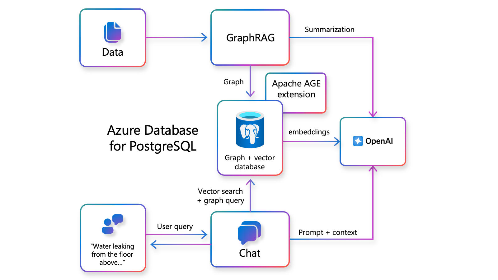
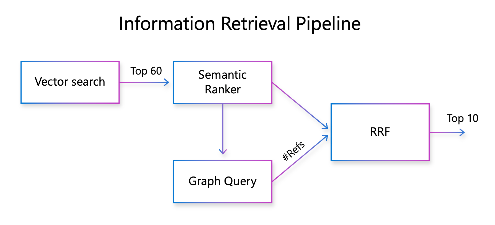

# GraphRAG Solution Accelerator for Azure Database for PostgreSQL
This solution accelerator is designed as an end-to-end example of a Legal Research Copilot application. It demonstrates the implementation of three information retrieval techniques: vector search, semantic ranking, and GraphRAG on Azure Database for PostgreSQL, and illustrates how they can be combined to deliver high quality responses to legal research questions. The app uses the U.S. Case Law dataset of 0.5 million legal cases as a source of the factual data. For more details on these concepts, [please see the accompanying blog to this solution accelerator here](https://aka.ms/pg-graphrag).

## Solution Accelerator Architecture

<p align="center">

</p>

## Solution Accelerator Concepts

As the architecture diagram shows, this solution accelerator brings together **vector search, semantic ranking, and GraphRAG**. Here are some highlights, including the information retrieval pipeline:

<details>
  <summary><b>Semantic Ranking</b></summary>
    Enhances vector search accuracy by re-ranking results with a semantic ranker model, significantly improving top results' relevance (e.g., up to a 10–20% boost in NDCG@10 accuracy). The semantic ranker is available as a standalone solution accelerator, detailed in the blog: Introducing Semantic Ranker Solution Accelerator for Azure Database for PostgreSQL.
</details>

<details>
  <summary><b>GraphRAG</b></summary>
    An advanced RAG technique proposed by Microsoft Research to improve quality of RAG system responses by extracting knowledge graph from the source data and leveraging it to provide better context to the LLM. The GraphRAG technique consists of three high level steps:
    1. Graph extraction 
    2. Entity summarization 
    3. Graph query generation at query time 
</details>

<details>
  <summary><b>Information Retrieval Pipeline</b></summary>
    We leverage the structure of the citation graph at the query time by using specialized graph query. The graph query is designed to use the prominence of the legal cases as a signal to improve the accuracy of the information retrieval pipeline. The graph query is expressed as a mixture of traditional relational query and OpenCypher graph query and executed on Postgres using the Apache AGE extension. The resulting information retrieval pipeline is shown below.
    <p align="center"></p>
</details>

## Further Reading
For related solution accelerators and articles please see the following:
- [Introducing GraphRAG Solution for Azure Database for PostgreSQL ](https://aka.ms/pg-graphrag)
- [Semantic Ranker Solution Accelerator for Azure Database for PostgreSQL](https://github.com/microsoft/Semantic-Ranker-Solution-PostgreSQL)
- [GraphRAG: Unlocking LLM discovery on narrative private data](https://www.microsoft.com/en-us/research/blog/graphrag-unlocking-llm-discovery-on-narrative-private-data/)
- [Reciprocal Rank Fusion (RRF) explained in 4 mins](https://medium.com/@devalshah1619/mathematical-intuition-behind-reciprocal-rank-fusion-rrf-explained-in-2-mins-002df0cc5e2a)

## Deployment and Development
The steps below guides you to deploy the Azure services necessary for this solution accelerator into your Azure subscription.

### Prerequisite Steps for Semantic Ranking ML Endpoint

⚠️ **NOTE:** In order to run the Semantic Ranking part of this accelerator, it requires you have an Azure ML Endpoint running a ranking model such as “bge-reranker-v2-m3”.  As a way to get this up and running, you can deploy following related solution accelerator which will setup an Azure ML Endpoint for ranking scoring:

- [Semantic Ranking in Azure Database for PostgreSQL Flexible Server](https://github.com/microsoft/Semantic-Ranker-Solution-PostgreSQL)

👉 Follow the steps in the repo above first before moving on to the deployment steps below.

👉 Once you deploy this accelerator, notate the `"/score"` REST endpoint URI and the key.  You will need these in the steps below when deploying.

### Deployment Steps
1. Enter the following to clone the GitHub repo containing exercise resources:
    ```bash
    git clone https://github.com/Azure-Samples/graphrag-legalcases-postgres.git
    cd graphrag-legalcases-postgres
    ```
2. Use sample .env to create your own .env
    ```bash    
    cp .env.sample .env    
    ```
3. Edit your new .env file to add your Azure ML Semantic Ranker endpoints
    - Use the values obtained during the Prerequisite Steps above.
    - Replace the values between the {} with your values for each.
    ```bash
    AZURE_ML_SCORING_ENDPOINT={YOUR-AZURE-ML-ENDPOINT}
    AZURE_ML_ENDPOINT_KEY={YOUR-AZURE-ML-ENDPOINT-KEY}
    ```
4. Login to your Azure account
    ```bash
    azd auth login
    ```
5. Provision the resources
    ```bash
    azd up
    ```
    - Enter a name that will be used for the resource group.    
    - This will provision Azure resources and deploy this sample to those resources, including Azure Database for PostgreSQL Flexible Server, Azure OpenAI service, and Azure Container App Service.

## Contributing

This project welcomes contributions and suggestions. Most contributions require you to agree to a Contributor License Agreement (CLA) declaring that you have the right to, and actually do, grant us the rights to use your contribution. For details, visit https://cla.microsoft.com.

When you submit a pull request, a CLA-bot will automatically determine whether you need
to provide a CLA and decorate the PR appropriately (e.g., label, comment). Simply follow the
instructions provided by the bot. You will only need to do this once across all repositories using our CLA.

This project has adopted the [Microsoft Open Source Code of Conduct](https://opensource.microsoft.com/codeofconduct/).
For more information see the [Code of Conduct FAQ](https://opensource.microsoft.com/codeofconduct/faq/) or contact [opencode@microsoft.com](mailto:opencode@microsoft.com) with any additional questions or comments.

## Trademarks

This project may contain trademarks or logos for projects, products, or services. Authorized use of Microsoft trademarks or logos is subject to and must follow [Microsoft’s Trademark & Brand Guidelines](https://www.microsoft.com/en-us/legal/intellectualproperty/trademarks/usage/general). Use of Microsoft trademarks or logos in modified versions of this project must not cause confusion or imply Microsoft sponsorship. Any use of third-party trademarks or logos are subject to those third-party’s policies.